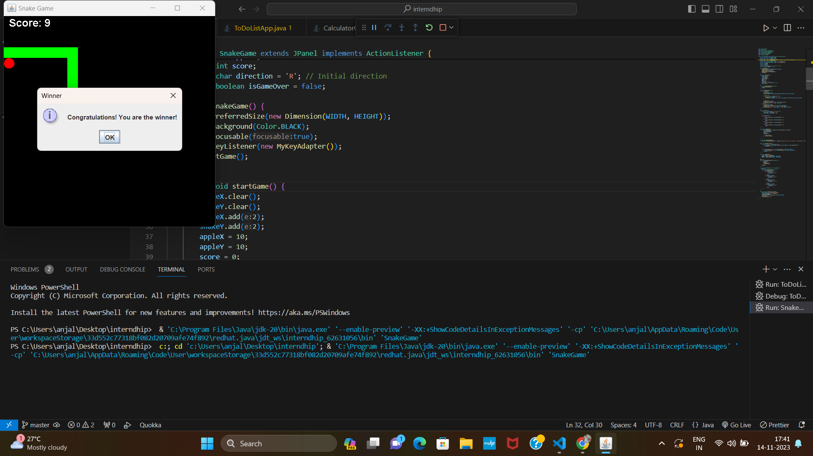
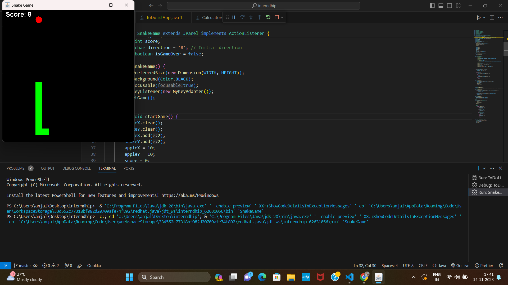

# Snake Game

Snake Game is a simple implementation of the classic Snake game using Java Swing. It provides a basic gaming experience with a snake that grows longer as it eats apples, aiming to achieve a higher score without colliding with itself or the game boundaries.

## Features

- Control the snake's direction using arrow keys (Up, Down, Left, Right).
- Grow the snake's length by eating apples.
- Keep track of the score.
- Display a "Game Over" message when the snake collides with itself or the game boundaries.
- Show a winner popup when the score reaches 10.

## Getting Started

### Prerequisites

- Java Development Kit (JDK) installed on your machine.

### Running the Game

1. Clone the repository:

   ```bash
   git clone https://github.com/hari7261/SnakeGame.git
   ```

2. Compile the Java files:

   ```bash
   javac SnakeGame.java
   ```

3. Run the game:

   ```bash
   java SnakeGame
   ```

4. Use arrow keys to control the snake's direction and enjoy the game!

## How to Play

- Control the snake's direction with the arrow keys.
- Eat apples to grow longer and increase your score.
- Avoid colliding with the snake's own body and the game boundaries.
- Reach a score of 10 to see the winner popup.

## Contributors

- ##Hariom kumar pandit

## License

This project is licensed under the MIT License - see the [LICENSE](LICENSE) file for details.

## Acknowledgments

- The project was created as a simple game of a Snake game using Java Swing.

## Screenshots




Feel free to add additional sections or details based on your preferences or any specific information related to your implementation of the Snake Game.
